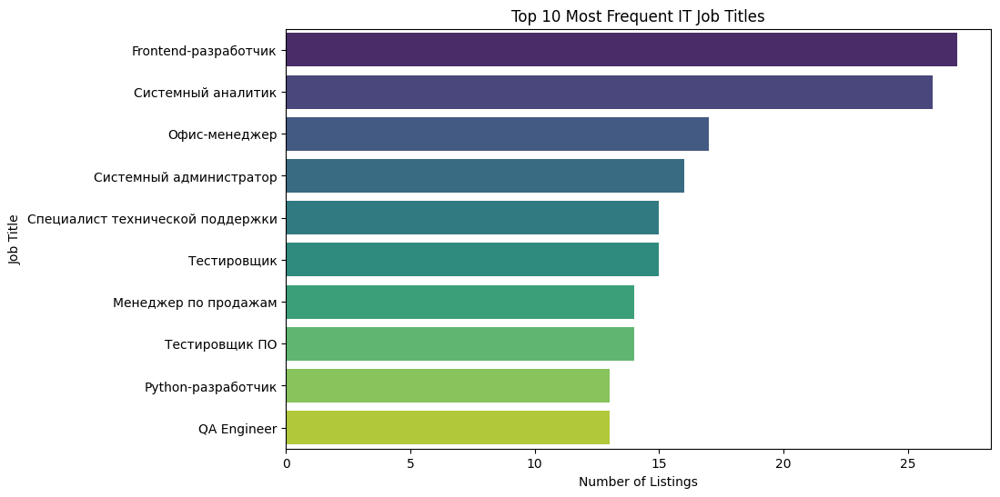
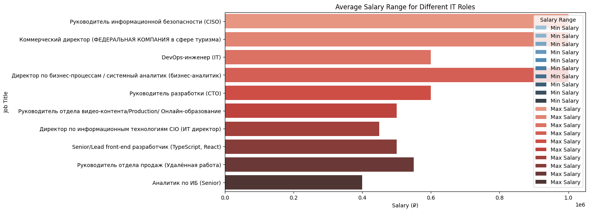
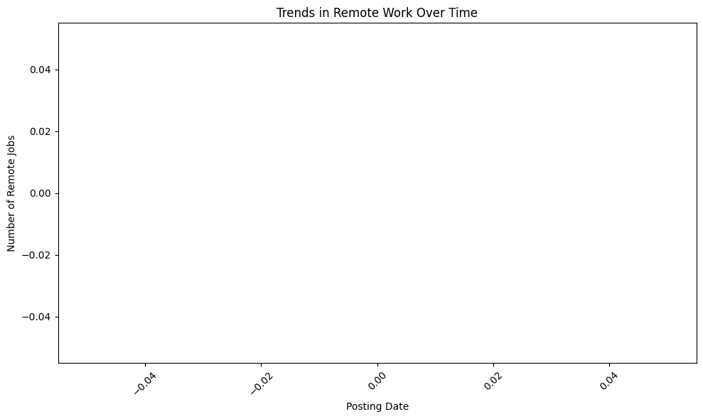
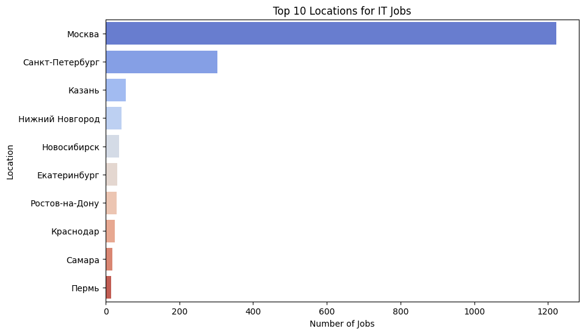

IT Job Vacancies Analysis
```markdown

This project analyzes IT job vacancies retrieved from the [hh.ru API](https://api.hh.ru/).
It collects data on IT job listings in Russia (area ID 113), processes the information, and provides insights into job titles,
salary ranges, remote work trends, and geographical distribution. The results are visualized using various plots created with
Matplotlib and Seaborn.

Description

The project is implemented in a Jupyter notebook (`IT_Job_Vacancies_Analysis.ipynb`) and performs the following steps:

1. Data Collection: Retrieves up to 2000 IT job vacancies from the hh.ru API using the `requests` library.
2. Data Preprocessing: Converts the raw API data into a structured pandas DataFrame, extracting fields like job title,
salary, location, employment type, and posting date. It also attempts to parse salary ranges into minimum and maximum values.
3. Data Analysis: Computes:
   - The top 10 most frequent job titles.
   - Average minimum and maximum salaries for each job title.
   - Trends in remote work based on posting dates.
   - The top 10 locations with the most job listings.
4. Data Visualization: Generates four plots to illustrate the analysis results.
```
## Requirements

- Python 3.x
- Required libraries:
  - `requests`
  - `pandas`
  - `matplotlib`
  - `seaborn`

Install the dependencies using pip:

```bash
pip install requests pandas matplotlib seaborn
```

## Usage

1. **Clone the Repository** (if applicable):
   ```bash
   git clone <repository-url>
   cd <repository-directory>
   

2. **Open the Notebook**:
   Launch Jupyter Notebook:
   ```bash
   jupyter notebook
   ```
   Then, open `IT_Job_Vacancies_Analysis.ipynb`.

3. **Run the Cells**:
   Execute the notebook cells in sequence to:
   - Fetch data from the hh.ru API.
   - Preprocess the data.
   - Analyze the data.
   - Generate and display the plots.

**Note**: The hh.ru API has a limit of 2000 items per query, so results may vary depending on when the data is retrieved.

## Plots

The notebook generates four visualizations based on the analysis. Save the plots from the notebook (e.g., using `plt.savefig('plot_name.png')`) and place them in an `images/` directory within the project folder.

### 1. Top 10 Most Frequent IT Job Titles



### 2. Average Salary Range for Different IT Roles



### 3. Trends in Remote Work Over Time



### 4. Top 10 Locations for IT Jobs



## Example Insights

- Job titles like "Тестировщик" (Tester) and "Python разработчик" (Python Developer) appear frequently.
- Salaries vary widely, e.g., "Technical Product Manager" (600,000 - 800,000 RUR) vs. "Python разработчик" (90,000 - None RUR).
- Locations like Moscow and St. Petersburg dominate the listings.
- Remote work trends depend on filtering for "Удаленная работа" (Remote work) in the `employment_type` column.

## Limitations and Improvements

- **Salary Parsing**: The salary parsing function assumes a specific format and may lead to NaN values for incomplete data.
- **Data Scope**: Limited to 2000 vacancies due to API restrictions.
- **Analysis Depth**: Could be expanded to include skills, experience levels, or salary distributions.
- **Time Sensitivity**: Results reflect a snapshot from the API at the time of retrieval.

## Contributing

Contributions are welcome! To contribute:
1. Fork the repository.
2. Make improvements.
3. Submit a pull request with a description of your changes.

Suggestions for extensions:
- Analyze required skills from job descriptions.
- Compare salary trends across regions.
- Add interactive visualizations using Plotly.
