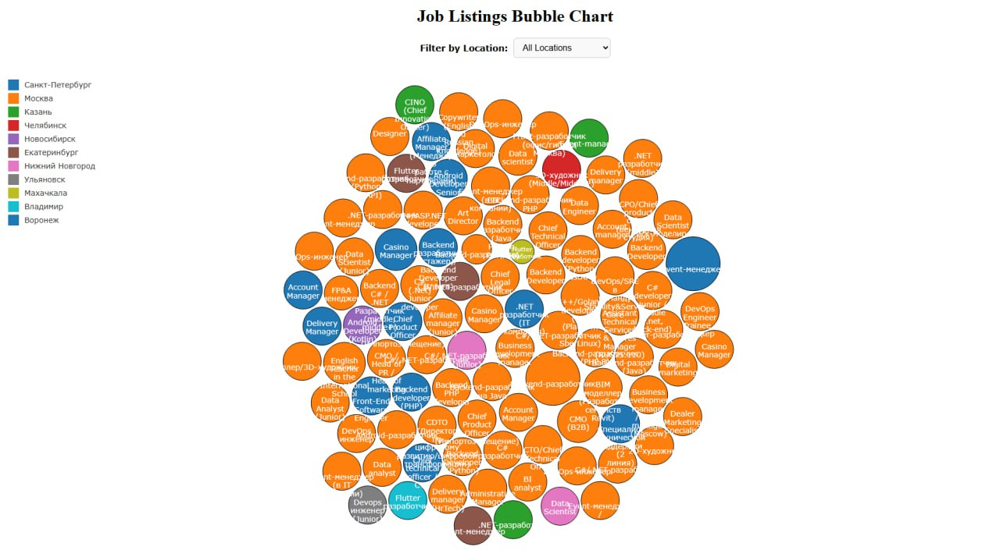

# IT Job Vacancies Analysis

This project analyzes IT job vacancies retrieved from the [hh.ru API](https://api.hh.ru/). 
It collects data on IT job listings in Russia (area ID 113), processes the information, and provides insights into job titles, 
salary ranges, remote work trends, and geographical distribution. The results are visualized using various plots created with 
Matplotlib, Seaborn, and now an interactive bubble plot powered by Vite, D3.js, and Flask.

Description

The project is implemented in a Jupyter notebook (`IT_Job_Vacancies_Analysis.ipynb`) and performs the following steps:

1. **Data Collection**:  
   - Retrieves up to 2000 IT job vacancies from the hh.ru API using the `requests` library.
   - Due to performance and visualization requirements, a sampled subset of the data may be used for certain visualizations (e.g., the bubble plot).

2. **Data Preprocessing**:  
   - Converts the raw API data into a structured pandas DataFrame, extracting fields like job title, salary, location, employment type, and posting date.  
   - Attempts to parse salary ranges into minimum and maximum values.

3. **Data Analysis**:  
   - Top 10 most frequent job titles.  
   - Average minimum and maximum salaries for each job title.  
   - Trends in remote work based on posting dates.  
   - Top 10 locations with the most job listings.

4. **Data Visualization**:  
   - Generates multiple plots (via Matplotlib and Seaborn) to illustrate the analysis results.  
   - Additional interactive bubble chart using D3.js served by a Flask backend.

---

## Requirements

- Python 3.x
- Required Python libraries:
  - `requests`
  - `pandas`
  - `matplotlib`
  - `seaborn`
  - `Flask`
- Node.js and npm (for Vite-based frontend)

Install the Python dependencies:

```bash
pip install requests pandas matplotlib seaborn Flask

## Usage

1. **Clone the Repository** (if applicable):
   ```bash
   git clone <repository-url>
   cd <repository-directory>
   

2. **Open the Notebook**:
   Launch Jupyter Notebook:
   ```bash
   jupyter notebook
   ```
   Then, open `IT_Job_Vacancies_Analysis.ipynb`.

3. **Run the Cells**:
   Execute the notebook cells in sequence to:
   - Fetch data from the hh.ru API.
   - Preprocess the data.
   - Analyze the data.
   - Generate and display the plots.

**Note**: The hh.ru API has a limit of 2000 items per query, so results may vary depending on when the data is retrieved.

## Plots

The notebook generates four visualizations based on the analysis. Save the plots from the notebook (e.g., using `plt.savefig('plot_name.png')`) and place them in an `images/` directory within the project folder.

### 1. Top 10 Most Frequent IT Job Titles


### 2. Average Salary Range for Different IT Roles


### 3. Top 10 Locations for IT Jobs


## Interactive Bubble Plot with Vite, D3.js, and Flask

In addition to the static plots, the project includes an interactive bubble chart:

- **Data Sampling**:  
  A subset of the data is sampled for performance in visualization.

- **Frontend**:  
  Built with Vite and D3.js for rendering an interactive bubble plot.

- **Backend**:  
  Flask is used to serve job data as JSON via an API endpoint.

- **Features**:  
  Each bubble represents a job vacancy, color-coded by city. Users can filter by location using a dropdown menu.

### Screenshot:



## Example Insights

- Job titles like "Тестировщик" (Tester) and "Python разработчик" (Python Developer) appear frequently.
- Salaries vary widely, e.g., "Technical Product Manager" (600,000 - 800,000 RUR) vs. "Python разработчик" (90,000 - None RUR).
- Locations like Moscow and St. Petersburg dominate the listings.
- Remote work trends depend on filtering for "Удаленная работа" (Remote work) in the `employment_type` column.

## Limitations and Improvements

- **Salary Parsing**: The salary parsing function assumes a specific format and may lead to NaN values for incomplete data.
- **Data Scope**: Limited to 2000 vacancies due to API restrictions.
- **Analysis Depth**: Could be expanded to include skills, experience levels, or salary distributions.
- **Time Sensitivity**: Results reflect a snapshot from the API at the time of retrieval.

## Contributing

Contributions are welcome! To contribute:
1. Fork the repository.
2. Make improvements.
3. Submit a pull request with a description of your changes.

Suggestions for extensions:
- Analyze required skills from job descriptions.
- Compare salary trends across regions.
- Add interactive visualizations using Plotly.
